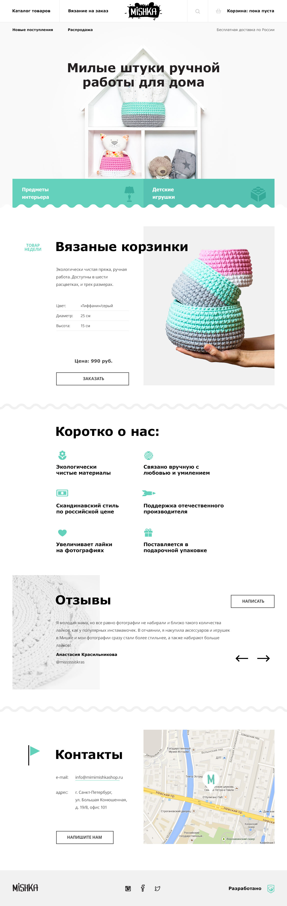
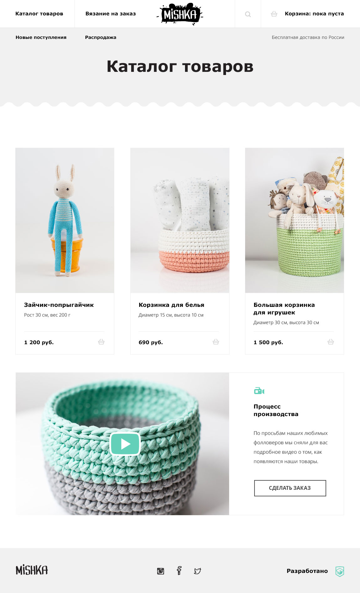

# Личный проект «Мишка» [![Build status][travis-image]][travis-url]  [![Dependency status][dependency-image]][dependency-url] 

<table>
  <thead>
    <tr>
      <th>Команда</th>
      <th>Результат</th>
    </tr>
  </thead>
  <tbody>
    <tr>
      <td width="30%"><code>npm i</code></td>
      <td>Установить зависимости</td>
    </tr>
    <tr>
      <td><code>npm start</code></td>
      <td>Запустить сборку, сервер и слежение за файлами</td>
    </tr>
    <tr>
      <td><code>npm start ЗАДАЧА</code></td>
      <td>Запустить задачу с названием ЗАДАЧА (список задач в <code>gulpfile.js</code>)</td>
    </tr>
  </tbody>
</table>

---

_Не удаляйте и не обращайте внимание на файлы:_ 
_`.editorconfig`, `.gitignore`, `.travis.yml`, `package.json`,`.csscomb.json`_
---

[travis-image]: https://travis-ci.org/webistomin/mishka-adaptive.svg?branch=master
[travis-url]: https://travis-ci.org/webistomin/mishka-adaptive
[dependency-image]: https://david-dm.org/webistomin/mishka-adaptive/dev-status.svg
[dependency-url]: https://david-dm.org/webistomin/mishka-adaptive
